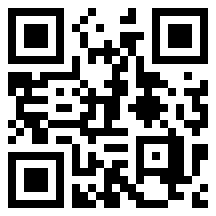
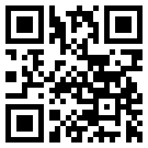

# Actually Automatic
## Automatic iOS update notifications that actually work 🤯

The "Automatic Updates" feature in iOS is slow and unpredictable. Get notified whenever Apple releases a new iOS update, and start installing the latest security fixes and new features without the wait!

**Supported services:**
* [Discord](https://discord.com/)
* Email ([SMTP](https://en.wikipedia.org/wiki/Simple_Mail_Transfer_Protocol))
* [Signal](https://signal.org/)
* [Slack](https://slack.com/)
* [SMS](https://en.wikipedia.org/wiki/SMS)
  * [SimpleTexting](https://simpletexting.com/)
  * [Twilio](https://www.twilio.com/sms)
* [Telegram](https://telegram.org/)

## The Easy Way or the Easier Way

You can follow the self-hosting [setup instructions](SETUP.md) to send custom notifications about new iOS updates from your own server.

To make things even easier, the Actually Automatic project maintains a couple of free notification options that are powered by the same open source program — no setup necessary!

* Join the [@SoftwareUpdates](https://t.me/SoftwareUpdates) channel on Telegram.

  
* Or simply text SUBSCRIBE to **+1-833-942-4941** to sign up for the SMS notification list.

  
  * Your number will never be bought or sold or used for any other purpose.
  * [CTIA](https://www.ctia.org/about-ctia/our-mission/) Compliance Statement: By texting SUBSCRIBE, you agree to receive informational messages sent via an autodialer, and this agreement isn't a condition of any purchase. Carrier message and data rates may apply.
  * Text STOP to unsubscribe at any time.

## Questions and Answers

### Why does this matter?
> "Keeping your software up to date is one of the most important things you can do to maintain your Apple product's security." — [Apple](https://support.apple.com/en-us/HT201222)

Almost every new iOS release includes critical bug fixes for a variety of security vulnerabilities, but **iOS doesn't tell you when a new update is available.**

This project's goal is to help close that gap.

### Wait, aren't iOS updates automatic?

Sort of. Slowly. Sometimes.

If Automatic Updates are enabled (`Settings > General > Software Update > Automatic Updates`), your iPhone *might* download and install the new iOS update several days or weeks later — but only if all of the following conditions are true:

1. It's plugged in or resting on a wireless charger.
2. It's connected to WiFi.
3. It thinks that it's "overnight."
   * Users can also chose an installation time in the notification that only appears **after** an update has already been downloaded, but this download won't happen automatically without a WiFi connection.

There are a lot of ways that three seemingly simple rules can go wrong ([just ask Isaac Asimov](https://en.wikipedia.org/wiki/Three_Laws_of_Robotics)). These rules are no exception.

Here are a few examples where automatic updates sometimes don't work very well under real-world conditions:

* **No WiFi.**
  * No automatic updates.
* **Annoying captive-portal WiFi.**
  * Unless you really commit to repeatedly filling out those tiny forms that ask for your last name and hotel room number every couple of hours, it's possible that you won't be connected to WiFi during the pivotal and opaque moment when iOS decides to check for and download an update.
* **You have the audacity to charge your phone during the day or in your own car.**
  * There's no need to plug in your phone again at home if it's already fully charged.
  * You probably don't have WiFi in your car.
* **You recently flew through the air on a work trip or dream vacation.**
  * The concept of "overnight" isn't always compatible with time zones (or adventure).

### How do the people in Cupertino describe this process?

Apple regularly publishes detailed revisions to their [Apple Platform Security documentation](https://support.apple.com/guide/security/welcome/web), but even though the subject of "Automatic Updates" seems highly relevant to this topic, that phrase is only mentioned twice overall — and only once in the context of iOS in Apple's [latest PDF guide](https://manuals.info.apple.com/MANUALS/1000/MA1902/en_US/apple-platform-security-guide.pdf) that spans more than 210 pages (as of May 2022).

Very few details are provided. Dedicated readers can learn a few fascinating facts about the "Escrow keybag" where automatic updates are briefly mentioned, but there's nothing about when and how update checks are performed, or what protections (if any) are in place to ensure that users will eventually find out about available updates with critical security fixes.

### How quickly are automatic updates applied under perfect conditions?

Even with the ideal combination of flawless WiFi, an uninterrupted connection to power, and a stable "overnight" situation, automatic updates can still take quite a while. A [popular thread on Reddit](https://www.reddit.com/r/ios/comments/trj7c1/craig_federighis_response_to_question_about_ios/) was started after Apple's Senior Vice President of Software Engineering purportedly responded to an email inquiry that was sent on behalf of Apple users who were confused about how Automatic Updates were supposed to work.

The reply from [Craig Federighi](https://www.apple.com/leadership/craig-federighi/) (which exists in the form of a screenshot, not in any official documentation) states that iOS updates are rolled out incrementally and that automatic updates begin "1-4 weeks later (after we've received feedback on the update)."

For users and organizations who care about security, "1-4 weeks later" could feel approximately 1-4 weeks too late.

### Shouldn't people be given the option to get notified about new updates right away?

A staged roll-out strategy (that can take up to 4 weeks!) might make a bit of sense when introducing new features. Let the enthusiasts who habitually check for updates in the Settings app kick the tires first, and then start a full-scale roll-out after responding to their feedback and making any necessary adjustments.

The problem, of course, is that Apple oftentimes deploys fixes for critical security vulnerabilities right alongside new features in the same release. A month-long staged roll-out process arguably doesn't make much sense for a security fix that could help protect millions of users and their data.

Apple could easily add an additional toggle to the existing Automatic Updates settings page (e.g. "Notify When Available") and this entire project would no longer be necessary.

Hopefully they will do that someday.

### Does quickly installing updates really matter?

It's difficult to fix something without also revealing what's broken. Within moments of any new iOS release, people all over the world start closely examining the changes. Some of those people are not good people, and some of them learn about new vulnerabilities that they can start exploiting right away before the update has been widely deployed.

Similarly, any attackers who already knew about the vulnerability previously had a reason to be judicious and careful in how they used it. They wanted the vulnerability to remain secret so that Apple wouldn't fix it. However, now they may instead be motivated to race against the update and try to compromise as many devices as possible before the window for exploiting this previously hidden vulnerability has completely closed. 

When it comes to installing security-related bug fixes and updates, faster is always better.

## Legal

All trademarks are property of their respective trademark holders. This project is not affiliated with Apple.
